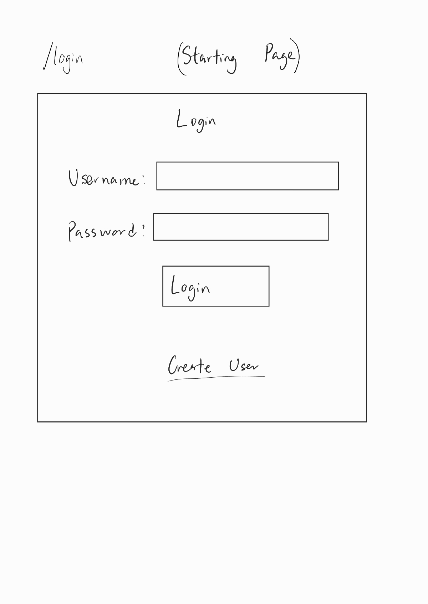
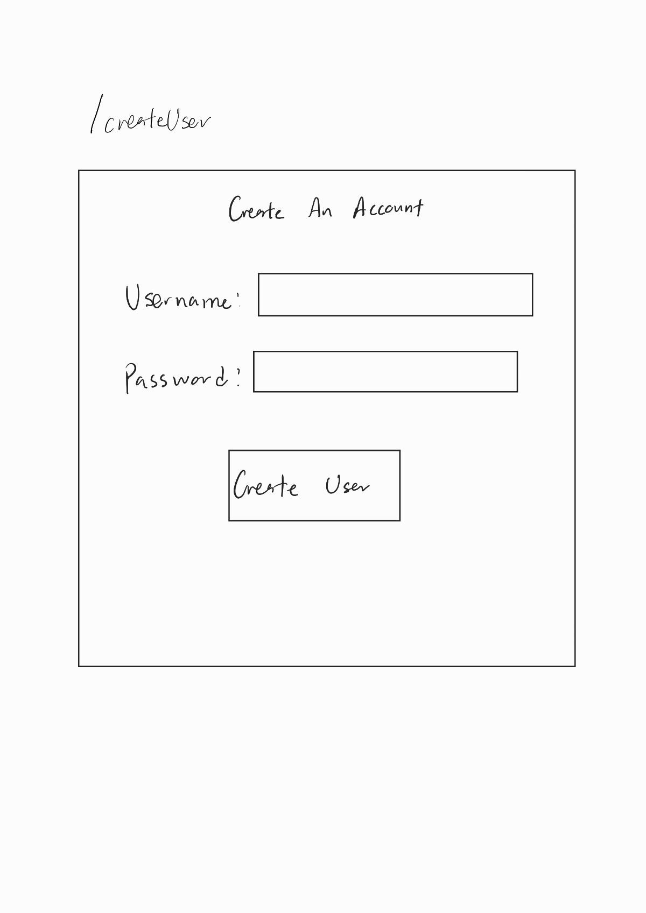
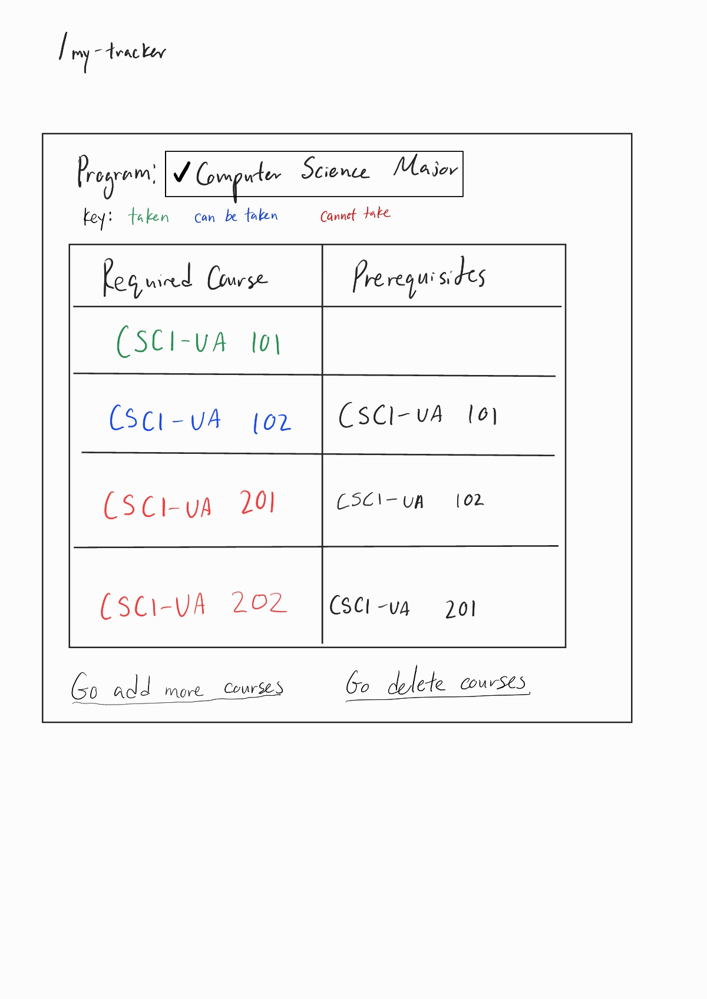
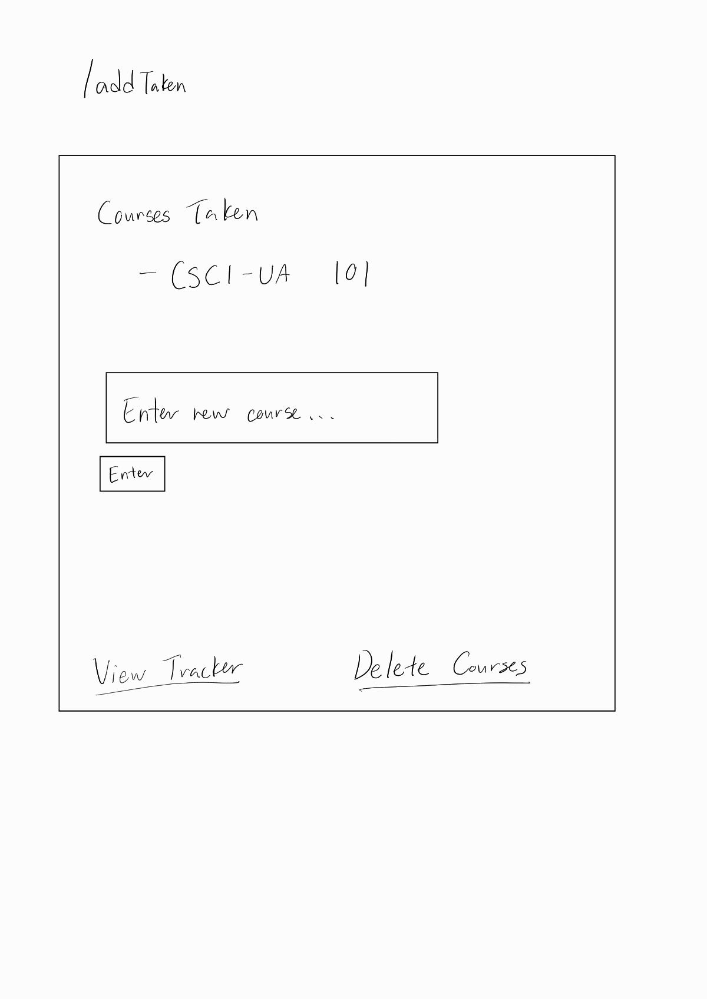
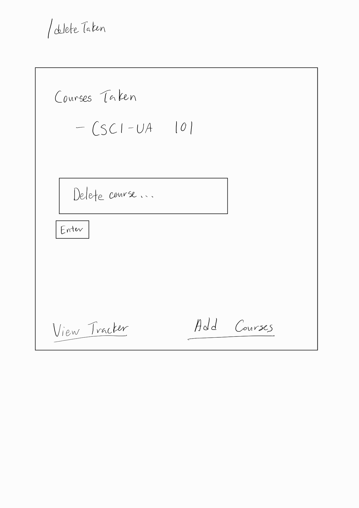
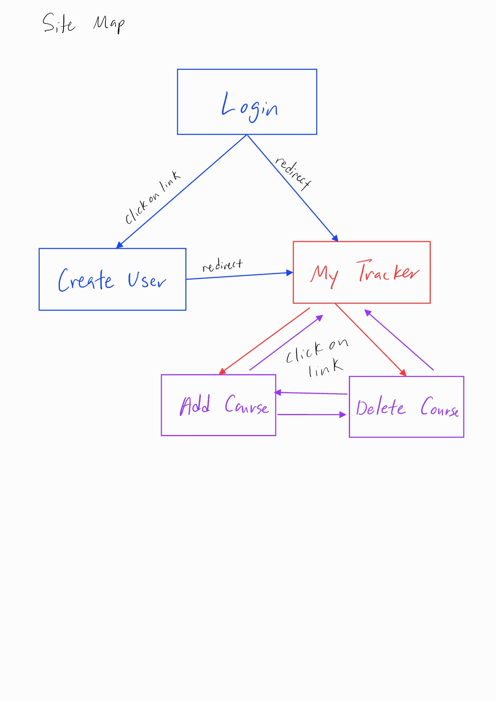
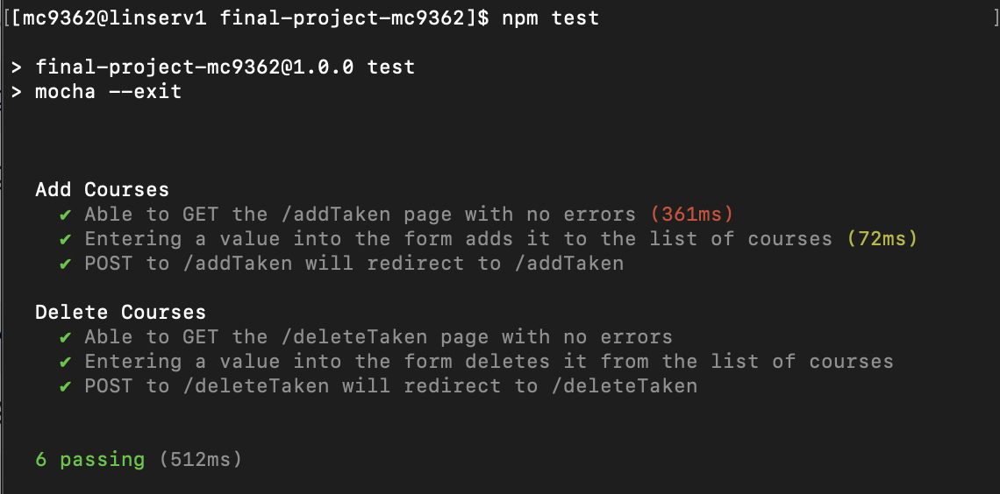
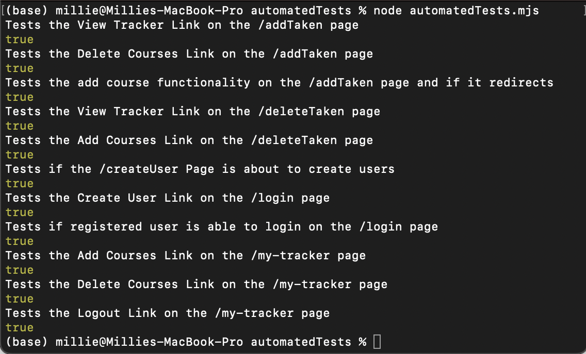

# Computer Science Major/Minor Requirement Tracker 

## Overview

Looking through all the resources to find the requirements to fullfill your Computer Science major/minor (and the prerequisites for each course) can be confusing and a lot of work. This Computer Science Major/Minor Requirement Tracker will make it easier for you to visualize what courses are required for your computer science major/minor/joint-major and the prerequisites for each. This can also be used to help plan your course registration because it will take input from the user to determine what courses they have taken already and show them a table of what courses they still need to take and what courses they are able to take given the courses that they took already. Users can also register and login to save their information.  

## Data Model

The application will store Users(and list of Courses Taken), list of Courses, and Required Courses for CS Major/Minor/Joint-Major(including prerequisites)

* users can have a list of courses taken(via references)
* there will be a predetermined database of required courses for each Major/Minor/Joint-Major ("predetermined" meaning user cannot change this, via references)
* there will also be a database of all the Courses for the CS Major/Minor/Joint-Major(including prerequisites)
* each course can have multiple prerequisites (via references)


An Example User with Referenced Items:

```javascript
{
  // Description: the User documents will have a username, password, and a list of courses taken
  
  username: "student1",
  hash: // a password hash,
  coursesTaken: [CS101_id]// an array of references to Course documents
  // NOTE: in reality, the Object ID for the corresponding Course document will be used
}
```

An Example RequiredCourses with Referenced Items:

```javascript
{
  // Description: the RequiredCourses documents will have a program name(either CS major/minor/joint-major) and a list of required courses for that program

  program: "Computer Science Major",
  courses: [CS101_id, CS102_id, CS201_id, CS202_id......]//an array of references to Course documents
  // NOTE: in reality, the Object ID for the corresponding Course document will be used

}
```

An Example Course with Referenced Items:

```javascript
{
  // Description: the Course documents will have the name of the course and a list of prerequisites

  name: "CSCI-UA 102",
  prerequisites: [CS101_id]// an array of references to Course documents (referencing other courses)
  // NOTE: in reality, the Object ID for the corresponding Course document will be used

}
```


## [Link to Commented First Draft Schema](db.mjs) 

## Wireframes

/login - page for logging in



/createUser - page for creating a new account



/my-tracker - main page for displaying requirement tracker



/addTaken - page for adding courses taken



/deleteTaken - page for deleting courses taken



## Site map 



## User Stories or Use Cases

1. As a non-registered user, I want to register a new account so that I can save my information.
2. As a registered user, I want to log in to the site so that I can use the requirement tracker.
3. As a registered user, I want to choose my major/minor/joint-major from the dropdown menu so that the requirement tracker will display the correct required courses for the program that I am in.
4. As a registered user, I want to add courses to the list of courses I have taken so that the requirement tracker can determine which courses I can take and which courses I still need to take.
5. As a registered user, I want to delete courses from the list of courses I have taken so that I can delete a course if I entered in a wrong course.
6. As a registered user, I want to view a list of courses I have taken to so that I can add/delete courses accordingly. 
7. As a registered user, I want to view my requirement tracker so that I can see which courses I can take, which courses I still need to take, and which courses I have taken already.

## Research Topics

* (5 points) Use a server-side JavaScript library or module that we did not cover in class
    * I'm going to be using passport for user authentication.
    * Passport can be used to authenticate users and also for session management for users. 
    * I will be using this for signing in with username and password.
    * I will also be using this to create login sessions for each user.
* (3 points) Unit testing with JavaScript
    * I'm going to use Mocha for unit testing.
    * Mocha is used to check that a small section of your code is working by running the pre-written test cases on that section of code. 
    * I'm going to create tests to ensure that the adding and deleting courses functionality works.
    * I'll also use it to make sure that both the login page and create account page redirects to the my-tracker page.
* (5 points) Automated functional testing for all of your routes
    * I'm going to use Selenium to develop automated testing for my routes.
    * Selenium is used so that you can write code to automate the testing process(instead of you having to manually check the webpages in a browser). 
    * Specifically, I will be using Selenium WebDriver to make sure that all the links to other pages are working.
    * I'm also going to use Selenium to create some user accounts to make sure that the login feature is working.
* (2 points) Use a CSS framework or UI toolkit
    * I'm going to use Bootstrap as the CSS framework for my project.
    * I'm going to use it to make my pages and forms look better with CSS.
    * I'm also going to use Bootstrap to create a constant theme across all the pages in the site.


15 points total out of 10 required points

## [Link to Initial Main Project File](app.mjs) 

## Annotations / References Used

References Used for Passport
* General documentation/references
    * https://www.npmjs.com/package/passport-local-mongoose 
    * https://www.passportjs.org/docs/
* Tutorials Referenced 
    * https://mherman.org/blog/user-authentication-with-passport-dot-js/
    * https://cs.nyu.edu/courses/spring24/CSCI-UA.0467-001/_site/slides/16/auth.html#/
    * https://www.geeksforgeeks.org/node-js-authentication-using-passportjs-and-passport-local-mongoose/ 

General Documentation References Used for Mocha and Supertest
* https://www.npmjs.com/package/supertest
* https://mochajs.org/

General Documentation References Used for Selenium WebDriver
* https://www.selenium.dev/documentation/webdriver/interactions/
* https://www.selenium.dev/documentation/webdriver/elements/interactions/
* https://www.selenium.dev/documentation/webdriver/elements/finders/
* https://www.selenium.dev/documentation/webdriver/getting_started/first_script/

## Changes in Project Since Milestone 1
* In addition to using Mocha, I am also using the SuperTest module for writing unit tests.
* For my Mocha Unit Tests, instead of testing that the the /login page and /createUser page redirects to the my-tracker page, I am testing if the /addTaken Page and /deleteTaken page redirects to their respective pages after a POST request.
* I have decided to NOT USE Bootstrap for this project: I will only be using Passport, Mocha, and Selenium, which adds up to 13 points total out of 10 required points.
* I have also changed the schema for User and I changed the coursesTaken field from an array of object IDs to an array of strings.

## Changes in Project/App Features Since Milestone 1
* I changed the features of the project so that now it ONLY keeps track of the Computer Science Major/Minor instead of ALL computer science major/minor/joint-majors.
* Note that instead of redirecting to /my-tracker, submitting the form for creating an user will now redirect to the /login page
* I have also changed the app so that its NOT required for users to login to use the progress tracker and add/delete taken pages. However, if you use the tracker and then log in, then the progress/information before the login will be lost(even if you log out, the info will not be there).
* In addition, on the /addTaken page, I have added a list all the of possible courses that the user can choose from for reference on the bottom of the page 
* I have also added a link to Logout on the bottom of the /my-tracker page
* Note that the major/minor requirements are not exactly the same as the offical requirements: some requirements has been simplified(for example, in the offical requirements, you can substitute the CS major electives with MATH courses but for this purposes of this app, I am only counting 400 level electives).


## Screen Capture of Tests
## Screenshot of Mocha Unit Testing


## Screenshot of Selenium Testing Outputs


## Screen Recording of Selenium Automated Testing
NOTE: To view the screen recording, please go to the documentation folder and click on SeleniumRecording.mov

The file was too large to be displayed so you might have to download it to view it.


